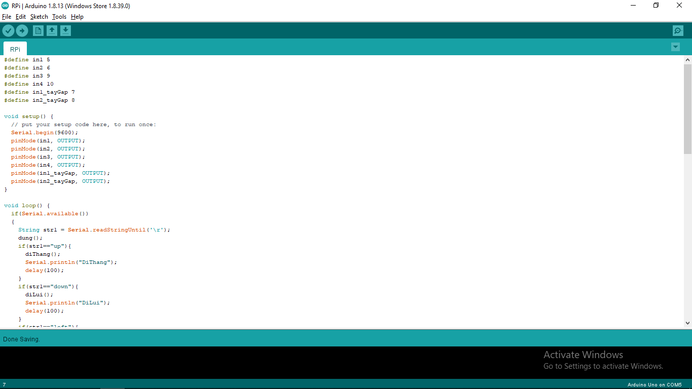
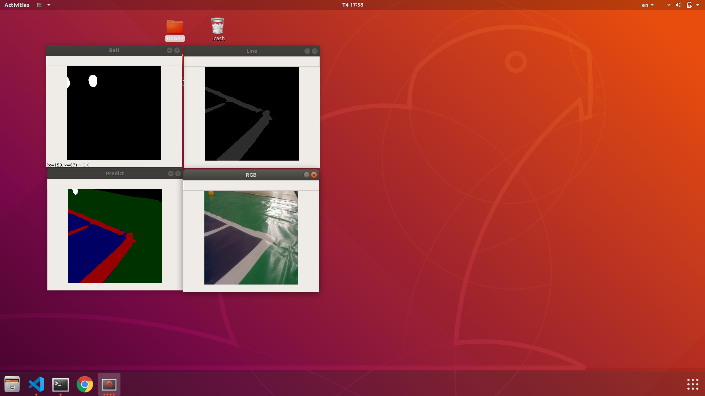

目次 {#目次 .TOC-Heading}
====

[成果物の概要 3](#成果物の概要)

[**I.** **トピックを紹介する** 4](#_Toc49855644)

[**I.1.** **トピックの名前** 4](#_Toc49855645)

[**I.2.** **トピックを選択する理由** 4](#_Toc49855646)

[**I.3.** **実行した手順の概要** 4](#_Toc49855647)

[**I.4.** **トピックの目標** 5](#_Toc49855648)

[**II.** **理論的根拠** 5](#_Toc49855649)

[**II.1.** **アイデア** 5](#_Toc49855650)

[**II.2.** **理論的根拠** 5](#_Toc49855651)

[**III.** **分析とシステム設定** 6](#_Toc49855652)

[**III.1.** **概括システム図** 6](#_Toc49855653)

[**III.2.** **部品と技術パラメーター** 7](#_Toc49855654)

[**III.3.** **ハードウェア** 9](#_Toc49855655)

[**III.4.** **ソフトウェア** 11](#_Toc49855656)

[**IV.** **結果** 12](#_Toc49855657)

[**IV.1.** **使用したデータ** 13](#_Toc49855658)

[**IV.2.** **結果** 15](#_Toc49855659)

[**V.** **結論** 17](#_Toc49855660)

[**V.1.** **アドバンテージ** 17](#_Toc49855661)

[**V.2.** **欠陥** 17](#_Toc49855662)

[**V.3.** **苦労した点** 17](#_Toc49855663)

[**V.4.** **改善が必要と思っている点** 17](#_Toc49855664)

[**VI.** **参考文献** 18](#_Toc49855665)

 {#section .list-paragraph}

成果物の概要 {#成果物の概要 .list-paragraph}
============

社会の発展に伴い、サッカー、バレーボール、水泳などのポピュラースポーツに加えて、テニスが現在人気のあるスポーツです。プレーヤーの方向性とテニスコートのレンタルの需要を把握することで、このテニスコートビジネスへの突入は、多くの高い経済効率をもたらすため、ビジネスパーソンの共通のトレンドになっています。テニスコートへの投資は、これからも発展していくと約束されている分野です。顧客の需要の増加に伴い、多くのテニスコートのビジネス投資家は、遊び場の品質を満たすだけでなく、サービスを宣伝して顧客のニーズを満たす必要があります。テニスプレーヤーがよく使用するサービスの1つは、誰かがテニスボールを拾うように雇うことです。しかし、採用は、高コスト、事前トレーニング、十分な人数などの多くの欠点に直面することがよくあります。この問題を解決するために、私とチームが提案したいソリューションは「テニスボールを拾うロボット」です。

チームのプロジェクトでは、ロボットがテニスボールを収集するプロセスをシミュレートします。
ロボットはテニスコートのラインに沿って走り、完全に自動化された原理で次々とボールを拾います。
ロボットは、テニスコートのラインに基づいて許可されたエリアでのみ実行され、バスケットでボールを拾うことができます。
私のチームは、テニスコートでボールを拾う作業を完全に自動化して、人件費を削減したいと考えています。
私のチームは、Raspberry、Arduino回路、L298Nモジュール、およびその他部品と組み合わせた複数のエンジンを使用して、テニスボールを拾うロボットを作成しています。
ソフトウェアに関しては、Tensorflow 1.13.0、Cuda
10.0の基盤に基づいて構築されたオブジェクトを識別するために機械学習を使用しています。

[]{#_Toc49855644 .anchor}**トピックを紹介する**

[]{#_Toc49855645 .anchor}**トピックの名前**

トピック：「**テニスボールを拾うロボット**」

[]{#_Toc49855646 .anchor}**トピックを選択する理由**

現在、市場には、テニスボールを拾うためのさまざまなツールがたくさんあります。例えば：コレクタボール、テニスボールを拾うチューブ、テニスボールを拾うバスケットなどです。ただし、これらのツールは完全に人力に依存しています
。テニボットと呼ばれるキックスターター会社の製品は、操作に必要な人力の問題を解決しましたが、価格が非常に高いため、あまり使用されていません。
「ロボットがテニスボールを拾う」というトピックでは、私のチームは、高い機能性を担保しつつ、低価格で製品を開発することで、市場で優位なポジションを築きたいと考えています。

**実行した手順の概要**

**ステップ1：**アイデア、機能を考案します。

**ステップ2：**システム構築、ハードウェアのアイデアを提案します、ハードウェア設計します。

**ステップ3：**ロボットの移動モーター、テニスボールを拾うモーターを購入して組み立てます。テニスコートのデザインと印刷します。

**ステップ4：**ネットワークと機械学習を研究します。

**ステップ5：**データを準備します。

**ステップ6：**ロボットの動きとボールを拾うモーターを制御するArduinoプログラムを作成します。

**ステップ7：**機械学習を仕上げて、テニスコートのラインに沿って走るロボットの制御プログラムで、ボールを認識するプログラムを作成します。

**ステップ8：**テニスコードでロボットを使用して実験を行います。

私のチームは2名のみであり、ほとんどの作業を一緒に実施します。

[]{#_Toc49855648 .anchor}**テーマの目標**

テニスボールを拾うロボットの動作をシミュレートし、ヒューマンコストを削減するのためにテニスコートでボールを拾う作業を完全自動化を目指します。企画、チームワーク、設計、組み立て、およびプログラムを設定するために学習した知識を適用して、トピックを完成させます。

[]{#_Toc49855649 .anchor}**理論的根拠**

[]{#_Toc49855650 .anchor}**アイデア**

テニスボールを拾うロボットの主な機能は、テニスコートを自動的に走り回り、バスケットでボールを拾うコートのボールを拾うことです。
プレイヤーの体験に影響を与えないようにするために、ロボットはフィールドに入ることができません。ですから、ロボットはフィールドに迷い込むのを避けるためにフィールドラインを特定する必要があります。
それと並行して、ロボットは、拾うために移動できる領域で最も近いボールを検出できます。

-   ロボットの実行プロセス：

ロボットは前部に取り付けられたカメラを使用して、周囲の物体を識別するために写真を撮ります。
現在、ロボットは5つのレイヤーを識別できます。フィールドの中の領域、フィールドの周りを移動できるロボットの領域、ボール、ライン、その他のオブジェクトです。

[]{#_Toc49855651 .anchor}**理論的根拠**

ますます発展する社会の文脈では、人工知能の開発はより強力です。
多くの人が興味を持ち、重視している人工知能の領域の1つは機械学習です。
では、機械学習とは何でしょうか？

機械学習は人工知能の分野で、特定の問題を解決するためにシステムがデータから自動的に「学習」できるようにする技術の研究と構築が含まれます。
機械学習は統計と強く関連しています。両方の分野がデータ分析を研究しているためですが、統計とは異なり、機械学習は計算の実行におけるアルゴリズムの複雑さに焦点を当てています。
^\[1\]^

多くの機械学習アルゴリズムがありますが、このトピックでは、監視学習を使用することにしました。このアルゴリズムは画像内のオブジェクト分類の問題を解決するため、最良かつ最も単純なアルゴリズムの1つであります。

III. []{#_Toc49855652 .anchor}**分析とシステム設定**

     1.  []{#_Toc49855653 .anchor}**概括システム図**

**図1：概要図**

**図2：具体化図**

{width="5.299179790026247in"
height="5.194444444444445in"}

2.  []{#_Toc49855654 .anchor}**部品と技術パラメーター**

**表1：トピックで使用される部品の表**

+-----------------------------+--------+-----------------------------+
| **名前**                    | **量** | **価格/                     |
|                             |        | 1ユニット（千ドン）**       |
+=============================+========+=============================+
| Raspberry Pi 4              | 1      | 1.850                       |
| コンピューターモデルB 4GB   |        |                             |
+-----------------------------+--------+-----------------------------+
| ArduinoUNOR3                | 1      | 115                         |
+-----------------------------+--------+-----------------------------+
| DC 3V 6V                    | 4      | 20                          |
| ギヤードモータとホイール    |        |                             |
+-----------------------------+--------+-----------------------------+
| Raspberry Pi                | 1      | 200                         |
| カメラモジュール            |        |                             |
+-----------------------------+--------+-----------------------------+
| 3.7V                        | 4      | 35                          |
| 2500mAh充電式バッテリー     |        |                             |
+-----------------------------+--------+-----------------------------+
| 4輪シャーシ                 | 3      | 50                          |
+-----------------------------+--------+-----------------------------+
| ３輪シャーシ                | 1.     | 30                          |
+-----------------------------+--------+-----------------------------+
| L298Nモジュール             | 2      | 30                          |
+-----------------------------+--------+-----------------------------+
| 種類の電線                  | 2種類  | 5                           |
+-----------------------------+--------+-----------------------------+
| ブレッ                      |        | 5                           |
| ドボードジャンパーワイヤー  |        |                             |
+-----------------------------+--------+-----------------------------+
| 9V /                        | 2      | 135                         |
| 5                           |        |                             |
| 55RPMヘンクウェルモーターと |        |                             |
|                             |        |                             |
| ホイール                    |        |                             |
+-----------------------------+--------+-----------------------------+
| スイッチ                    | 1      | 5                           |
+-----------------------------+--------+-----------------------------+
| 5V 3Aバックアップバッテリー | 1      | 600                         |
+-----------------------------+--------+-----------------------------+
| バスケット                  | 2      | 10                          |
+-----------------------------+--------+-----------------------------+
| モデル                      | 3      | 20                          |
| を作るために発泡スチロール  |        |                             |
+-----------------------------+--------+-----------------------------+
| カメラ延長コード            | 1      | 90                          |
+-----------------------------+--------+-----------------------------+
| 単三4本電池ボックス         | 1      | 20                          |
+-----------------------------+--------+-----------------------------+
| 卓球                        | 10     | 2                           |
+-----------------------------+--------+-----------------------------+
| テニスコートの模型          | 1      | 350                         |
+-----------------------------+--------+-----------------------------+
| ドローストリング            | 1袋    | 10                          |
+-----------------------------+--------+-----------------------------+
| セロテープ                  | 3種類  | 20                          |
+-----------------------------+--------+-----------------------------+
| Arduino UNO R3用            | 1      | 25                          |
| プリンターデータケーブル    |        |                             |
| USB 2.0 Aオスto Bオス 高速  |        |                             |
+-----------------------------+--------+-----------------------------+
| ネジ、銅柱                  |        | 10                          |
+-----------------------------+--------+-----------------------------+
| キャスター(3輪目の車輪）    | 1      | 12                          |
+-----------------------------+--------+-----------------------------+
| 合計                        |        | 4.147                       |
+-----------------------------+--------+-----------------------------+

**表2：主な部品**

  **名前**                                  **画像**
  ----------------------------------------- ----------------------------------------------------------------------------------------------------------------------------------------
  Raspberry Pi4 コンピューターモデルB 4GB   {width="1.1811023622047243in" height="1.1811023622047243in"}
  Arduino UNO R3                            {width="1.1811023622047243in" height="1.1811023622047243in"}
  DC 3V 6V ギヤードモータとホイール         {width="1.1811023622047243in" height="1.1811023622047243in"}
  Raspberry Piカメラモジュール              {width="1.1811023622047243in" height="1.1811023622047243in"}
  L298Nモジュール                           {width="1.1811023622047243in" height="1.1811023622047243in"}
  9V / 555RPMヘンクウェルモーター           {width="1.1811023622047243in" height="1.1811023622047243in"}

1.  []{#_Toc49855655 .anchor}**ハードウェア**

{width="5.0in" height="3.75in"}

画像1：最初のモデル画像は左側から見たものです

-   基本的なロボット部分：エンジン、Arduino、モジュールL298N、バッテリーをシャーシに取り付けます。

-   ボールを拾う斜面：

```{=html}
<!-- -->
```
-   ボールを拾う斜面のフレームを形成するため、2つのバスケットを使用します。バスケットはプラスチックで作って、たくさんの穴がありますから、フレームが頑丈で軽量になります。ですから、ロボットヘッドの重量を減らすことができます。

-   斜面のフレームにヘンクウェルモーターを固定するします。

-   ボールを拾うとき、ボールが外に出ないため、屋根として段ボールを使用します。

```{=html}
<!-- -->
```
-   ボールを保持する爪：

```{=html}
<!-- -->
```
-   ボールが飛び出さないようにして、ロボットの前にボールを集めるため、段ボールを使ってロボットの前に2つの爪を作ります。

**図3：回路リンク図**

1.  []{#_Toc49855656 .anchor}**ソフトウェア**

-   **マイクロコントローラーを部品にリンクするコード**

{width="5.0in"
height="3.4545067804024496in"}

画像2：マイクロコントローラーを部品にリンクするコード

-   **トピックで使用されているニュートロンネットワーク：Unet~­~^\[2\]^**

{width="4.5in"
height="2.9384612860892387in"}

画像3：Unetネットワークの構造

> **理由：**Unetネットワークは2015年に発表されたネットワークであり、現在は比較的古くなっているため、機械学習を開始するために比較的アクセスしやすくなっています。
> 処理速度と精度が許容範囲です。

-   入力：256x256画像

-   出力：256x256画像

-   速度：テンソルフローGPU
    1.13.0ライブラリを使用したGTX1650カードに、約0.0431秒/
    1画像（平均1000画像以上）

IV. []{#_Toc49855657 .anchor}**結果**

{width="5.0in"
height="3.7501432633420824in"}

画像4：ロボットの最終製品

1.  []{#_Toc49855658 .anchor}**使用したデータ**

このトピックで使用されるデータの100％は、私のチームが自分でLabelMeでLabelを作ります。このトピックは非常に特殊であるため、KaggleやImageNetなどの有名なデータサイトから必要なデータを見つけることができませんでした。

{width="2.5984251968503935in"
height="1.948817804024497in"}
{width="2.5984251968503935in"
height="1.948817804024497in"}

画像5：元の画像と分類されたオブジェクトの画像

-   ロボットの前のカメラから撮影した写真、サイズ640x480

```{=html}
<!-- -->
```
-   サイズ：5クラス（ボール、ライン、移動できるロボットの領域、フィールド、バックグラウンド）を含む400枚の画像と2クラス（ボールとバックグラウンド）を含む200枚の画像

-   トレーニング：600枚の画像

-   テストセット：0枚の画像

-   データ量が少ないため、私のチームはそれを使用してすべてをトレーニングして、モデルの安定性を評価するため、ロボットで直接実行するモデルを使用します。
    また、データの量が十分ではないため、ランダムなトリミングやランダムな明るさの変更によって入力データの量を増やすために、いくつかの方法を適用しました。
    結果は比較的肯定的です。

{width="6.0in"
height="3.373082895888014in"}

画像6：トレーニングの中での画像（右側の2つの画像はプレディクト、左側の2つの画像はラベルです）

{width="6.0in"
height="3.373077427821522in"}

画像7：トレーニングの中での画像（右側の2つの画像はプレディクト、左側の2つの画像はラベルです）

{width="3.6in"
height="2.457156605424322in"}

画像8：Mean IoU

1.  []{#_Toc49855659 .anchor}**結果**

ロボットは自体でフィールドの周りを移動できて、安定した照明条件下でボールを元のターゲットとして拾うことができました。
ただし、複雑な照明条件では、テニスコートがキャンバスで印刷されますから、眩しくなられて、干渉のオブジェクトの分類につながり、予想どおりロボットが不安定になりました。

{width="5.0in"
height="2.294332895888014in"}

画像9：比較的安定した光の中で、結果はかなり良かった

{width="5.0in"
height="2.2311996937882763in"}

{width="5.0in"
height="2.347620297462817in"}

画像10：テニスコートがキャンバスで印刷されますから、眩しくなられて、ロボットが不安定になりました

ビデオデモ: <https://youtu.be/1BEag7REedQ>

[]{#_Toc49855660 .anchor}**結論**

[]{#_Toc49855661 .anchor}**アドバンテージ**

-   速い処理速度です。

```{=html}
<!-- -->
```
-   安定した照明条件でうまく動作します。

```{=html}
<!-- -->
```
-   トピックのリクエストを解決します。

    []{#_Toc49855662 .anchor}**欠陥**

-   複雑な照明条件で、ロボットが不安定になりました。

-   Raspberry
    パイのコンフィギュレーションが十分に強くないために、強いサーバーが必要です。

    []{#_Toc49855663 .anchor}**苦労した点**

-   Raspberryでは処理時間が長すぎですから、ニーズを満たすことができません。ですから、処理するサーバーを構築する必要があります。

> Raspberryでは処理時間：4秒/ 1画像
>
> サーバーでは処理時間：テンソルフローGPU
> 1.13.0ライブラリを使用したGTX1650カードに、約0.0431秒/
> 1画像（平均1000画像以上）

-   コロナウイルスのため、私チームはかなり遅くテニスコートを印刷しました。だから、私たちはデータを準備する時間があまりありませんでした。データの量が十分ではないため、ランダムなトリミングやランダムな明るさの変更によって入力データの量を増やすために、いくつかの方法を適用しました。

    []{#_Toc49855664 .anchor}**改善が必要と思っている点**

```{=html}
<!-- -->
```
-   サーバーを使用する必要がないため、Raspberryの代わりにNvidia
    Jetsonを使用する。

-   自己充電、いっぱいになったらボールを大きいバスケットに注ぐこと、収集したボールの数を統計することなどのより多くの機能を開発します。

-   高い美学あるために、製品を設計します。

-   ロボットを最適化して生産コストを削減して、市販化できます。

    []{#_Toc49855665 .anchor}**参考文献**

> \[1\] 機械学習-- Topdev.vn
>
> \[2\] U-Net: Convolutional Networks for Biomedical Image Segmentation
> - Olaf Ronneberger, Philipp Fischer, and Thomas Brox -
> https://arxiv.org/pdf/1505.04597v1.pdf
>
> \[3\] Arduinoの使用方法に関するチュートリアル-- Arduinokit.vn
